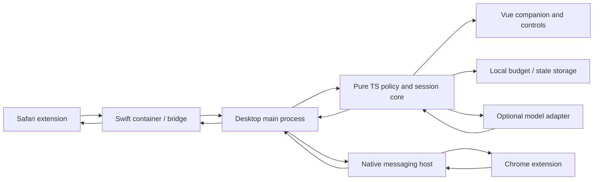

# Architecture and correctness

状态：实施设计，所有代码路径均为计划。M1 实验负责锁定平台细节。

## 模块边界

只有 core 产生干预意图；desktop/bridge 负责 I/O；浏览器端验证并执行动作；renderer 不持有
系统权限或密钥。模型是分类适配器，不是具有任意工具权限的 agent。

| 计划目录 | 职责 | 不应包含 |
| --- | --- | --- |
| `apps/desktop` | Electron main/preload、Vue UI、macOS 集成、Forge | 复制的领域规则 |
| `apps/extension` | 共享 web extension 源码、平台 manifest、页面提取/动作验证 | API key、账单结算 |
| `native/macos` | Safari 容器/扩展、Chrome host/桌面本地连接、必要原生能力 | 独立产品规则 |
| `packages/core` | session、policy、intervention、budget 纯逻辑 | Electron/DOM/模型 SDK |
| `packages/contracts` | 消息、存储、provider 输出的版本化 runtime schemas | 巨型通用工具集合 |
| `packages/providers` | OpenAI/Anthropic 适配器与 usage 归一化（M4 创建） | 决定关闭哪个 tab |
| `tests` | 跨边界场景、合成页面、脱敏评估样本 | 真实浏览历史、凭证 |

不要提前创建空 package；测试可按模块 colocate，跨模块场景放根 tests。

## 技术选择与重新评估条件

| 选择 | 理由 | 代价 / 替代方案 |
| --- | --- | --- |
| Electron + TS + Vue | 符合 TS 偏好；UI/动画与扩展共享语言 | 内存/体积；若实测资源目标长期不达标，评估原生 shell |
| Swift 仅平台桥接 | Safari 原生边界和 macOS 能力需要明确实现 | 多工具链；不假定全 TS 可以绕过 Safari 容器 |
| npm workspaces | 单 lockfile、简单命令与 CI | 无需引入额外构建编排器 |
| Electron Forge | 明确的打包/签名生命周期 | Safari bundling 不是开箱即用，M1 必须证实 |
| 本地存储适配器 | 单机、无账户、容易测崩溃恢复 | M0 设置可原子写 JSON；M3/M4 账本建议 SQLite 事务 |
| SQLite 账本（待选绑定） | 并发预留、幂等键、迁移与重启语义 | 原生 ABI/打包需验证；不能在 renderer 直接操作 |
| 云端小模型可选 | 语义能力按需使用 | 费用/隐私/网络；本地模型等实测需求再引入 |

Tauri 会引入 Rust 平台工作，全原生 Swift 会减少 TS 复用，Python GUI/后台会增加第二个
主要运行时；这些并非不能做，但当前无证据足以抵消既定方案的开发与维护优势。

## 领域词汇

- `FocusSession`：目标、模板、时长、状态、policyRevision、locale；同时最多一个活动时段。
- `TaskPolicy`：页面规则、音乐授权、干预参数；显式版本，修改使相关待执行动作失效。
- `PageObservation`：浏览器实例/profile/window/tab、导航序号、内容摘要指纹、时间和可见性。
- `RelevanceDecision`：related/unrelated/unknown；来源 rule/cache/model/user、原因、输入版本。
- `Intervention`：某个页面对应的提醒/倒计时；不是全局“猫咪生气等级”。
- `CloseIntent`：有期限、单次、绑定页面与 session 的动作意图；不是“关闭当前活动 tab”。
- `MusicPermit`：具体视频/播放列表上下文，可覆盖正常曲目切换；不等同域名/发声放行。
- `BudgetReservation`：请求发出前的持久化额度预留，之后结算或保守保留。

这些类型表达实际边界，不以泛用 workflow 框架或 event sourcing 扩大范围。

## 两个状态机与时钟

Session：`idle → running ↔ paused/break → ended`。锁屏/睡眠进入暂停；唤醒后由用户恢复。
崩溃重启只恢复为 paused，不恢复旧关闭倒计时。时长采用活动时段时间，暂停/睡眠不计入。
墙上时间用于日志与跨进程期限，进程内持续时间用可注入的单调时钟；时钟跳变触发重新核验。

Intervention：`observing → nudged → countdown → action_pending → closed/cancelled`。
unknown 不进入关闭链路。默认设计参数先取：无关页持续约 5 秒轻提醒，总计约 20 秒后
开始 15 秒明确倒计时；数值为可调整实验起点，不是医学或行为科学结论。

计时只累计浏览器真正前台时的目标页面停留。浏览器内部 active 不代表它是系统前台应用；
需要结合窗口 focus 和 macOS 前台应用信号。多屏可见但不在前台、后台音视频不能推断视线。
V1 按前台交互执行，不声称能检测用户正在看哪个屏幕。

离开无关页面取消本次可执行关闭命令；同一 session/内容的有限停留历史可保留，返回时仍给
明确倒计时，不静默立刻关页。pause/end/策略变化清除关闭授权；短暂来回切换不无限重置宽限。

## 浏览器协议与动作验证

每条消息携带 `protocolVersion`、连接实例/epoch、`messageId`、session/policy 版本和序号。
页面身份包含 browser instance + profile + window + tab + navigation revision；SPA 的实质
内容变化另有 content revision。连接重建换 epoch，初始握手发送当前快照以修复事件丢失。

close 流程：

1. core 确认 running、当前 policy、明确 unrelated、达到前台停留阈值。
2. 发出绑定页面身份、decision 输入版本、唯一 command ID 和短期失效时间的 CloseIntent。
3. 浏览器适配器核对当前连接/session/policy、页面导航/内容、焦点、音乐/编辑保护和期限。
4. 最接近执行时再读取页面身份；不匹配或不确定则拒绝；调用 tab close 并返回 ACK/outcome。
5. 成功/已不存在/拒绝/失败分别记账；重复命令只返回已知结果，不对新页面执行。

session authority 有短期 lease/heartbeat；end/pause 主动撤销，断连或 lease 到期拒绝新动作。
持有旧 session 的扩展不得因为主应用不可达而继续自主处罚。未知结果不得盲目重试 close。

**真实限制：** 查询 tab 与关闭 tab 通常是两次 API 调用，不能声称原子 compare-and-close。
原生 focus 查询、pause 撤销与实际 close 也有传播窗口。M1/M3 要做高频导航/暂停竞态实验，
记录残余风险；若无法达到可接受体验，采用更保守的取消或页面内阻断并提交产品取舍，
不能悄悄把“绝不误关”写进宣传。已被浏览器执行的关闭不能靠事后 pause 撤销。

编辑保护：在支持页面收集表单/contenteditable dirty 信号，给编辑器/聊天输入页面保守规则。
不存在通用的可靠“未保存”检测；无法确定的高风险编辑页面默认只提醒。恢复链接不等于恢复输入。

## 平台集成门槛

Chrome native messaging 只允许指定扩展 ID；持久连接和 worker 休眠后重连均需测试。
Safari 使用 Apple 容器与原生扩展通信；其桌面桥接需验证 sandbox、签名、容器权限及 IPC。
不允许把 Chrome 的 native host 路径假设照搬到 Safari。

优先经受控本地 IPC（例如有权限隔离的 Unix socket）连接 host 与桌面，明确配对/身份校验、
消息上限与版本拒绝规则；具体 Safari sandbox 可达性由 M1 决定。无认证 localhost HTTP
不是最终方案。host 注册、安装目录变化、卸载、旧版本兼容都属于交付范围。

## 安全、存储与数据生命周期

- Electron renderer 加载本地打包资源；sandbox、context isolation 开启，Node integration 关闭。
  preload 仅暴露窄 API，验证 IPC sender、schema 和导航目标，设置 CSP，拒绝任意 shell/URL 调用。
- Keychain 存 API key；UI 仅显示掩码及是否配置。provider 请求在特权进程中发送。
- 网页正文是不可信数据；不能指挥模型修改政策或发工具命令。云分析同意与扩展读取权限分开。
- 默认不保存正文/截图/聊天记录；最近必要片段只在内存；缓存用任务/策略/内容版本键且有 TTL。
- V1 私密浏览不采集、不分类、不关闭；权限引导说明该范围。
- 本地设置/模板持久化；恢复链接默认 24 小时且可立即清除；诊断元数据默认 7 天；
  费用账本默认 90 天。计费去重/当前周期额度所需最小状态在删明细后仍保留到周期结束。
- 恢复链接是明确例外，可能含敏感查询参数：本地保存、用户可关闭，不进入日志/模型/遥测。
- SQLite 迁移有版本和事务，迁移前备份；损坏时暂停干预，禁止静默重置预算或恢复惩罚。
- 全部用户数据驻本机；诊断导出由用户触发并先脱敏，不默认上传遥测。

## 官方依据与待验证边界

核对日期：2026-09-27。文档证明平台提供能力，不证明 FocusLit 集成已经成功。

- [Electron security](https://www.electronjs.org/docs/latest/tutorial/security)
- [Chrome native messaging](https://developer.chrome.com/docs/extensions/develop/concepts/native-messaging)
- [Safari app/extension messaging](https://developer.apple.com/documentation/safariservices/messaging-between-the-app-and-javascript-in-a-safari-web-extension)
- [Safari distribution](https://developer.apple.com/documentation/safariservices/distributing-your-safari-web-extension)
- [Electron Forge signing](https://www.electronforge.io/guides/code-signing/code-signing-macos)
